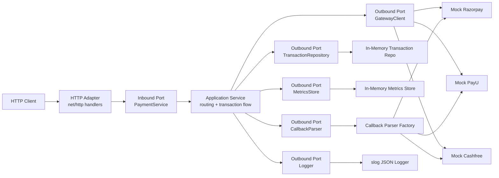
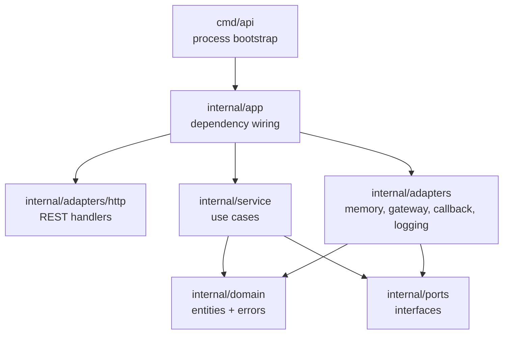
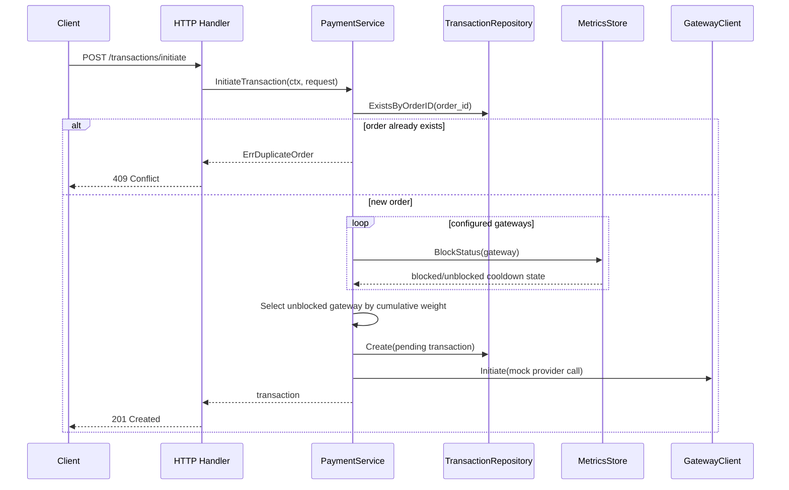
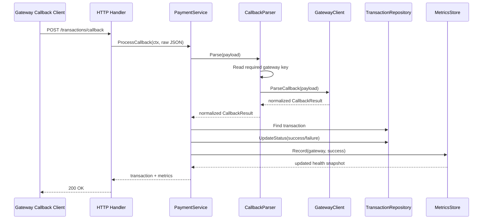
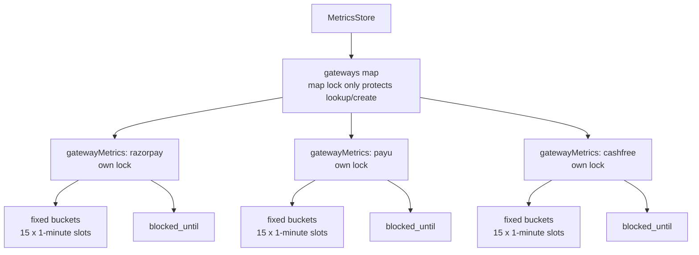

# payment-routing-service

Dynamic payment gateway routing service written in Go. The service routes payment transactions across Razorpay, PayU, and Cashfree using weighted routing, live gateway health, sliding-window metrics, and a cooldown circuit breaker.

A test deployment is deployed on Render.com: 
- [https://payment-routing-service.onrender.com/docs](https://payment-routing-service.onrender.com/docs)

**Table of Contents**

- [Run](#run)
- [Low-Level Design](#low-level-design)
- [APIs](#apis)
- [Routing Rules](#routing-rules)
- [Metrics Store](#metrics-store)
- [Integration Tests](#integration-tests)
- [Other Test Coverage](#other-test-coverage)
- [Mocked Components](#mocked-components)

## Run

```sh
go run ./cmd/api
```

Docker:

```sh
docker compose up api
```

Tests:

```sh
go test ./...
docker compose run --rm test
```

Race checks used for concurrency-sensitive adapters:

```sh
go test -race ./internal/adapters/memory ./internal/adapters/http
```
---
## Low-Level Design

The service uses hexagonal architecture. Core routing and payment use cases live in `internal/service`; external details live behind ports in `internal/ports` and adapters in `internal/adapters`.



### Package Layout



### Initiate Flow



### Callback Flow



### Metrics Store LLD


---
## APIs

Base URL for local runs:

```http
@baseUrl = http://localhost:8080
```

Interactive Redoc API docs and raw OpenAPI spec are served by the app:

```http
### Redoc API docs
GET {{baseUrl}}/docs

### raw OpenAPI specification
GET {{baseUrl}}/openapi.json
```

The OpenAPI spec documents the three service endpoints:

- `GET /healthz`
- `POST /transactions/initiate`
- `POST /transactions/callback`

### Health Check

```http
### health
GET {{baseUrl}}/healthz
```

Response:

```json
{
  "status": "ok"
}
```

### Initiate Transaction

Creates one local pending transaction and chooses one healthy gateway. This endpoint rejects duplicate `order_id`; it does not replay the existing transaction.

```http
### initiate transaction
POST {{baseUrl}}/transactions/initiate
Content-Type: application/json

{
  "order_id": "ORD123",
  "amount": 499.0,
  "payment_instrument": {
    "type": "card",
    "card_number": "****",
    "expiry": "12/29",
    "metadata": {
      "network": "visa"
    }
  }
}
```

Success response: `201 Created`

```json
{
  "transaction_id": "txn_...",
  "order_id": "ORD123",
  "amount": 499,
  "payment_instrument": {
    "type": "card",
    "card_number": "****",
    "expiry": "12/29",
    "metadata": {
      "network": "visa"
    }
  },
  "gateway": "razorpay",
  "status": "pending",
  "created_at": "2026-05-06T00:00:00Z",
  "updated_at": "2026-05-06T00:00:00Z"
}
```

Duplicate order response: `409 Conflict`

```json
{
  "error": "duplicate_order",
  "message": "transaction already exists for order"
}
```

No healthy gateway response: `503 Service Unavailable`

```json
{
  "error": "no_healthy_gateway",
  "message": "no healthy gateway available"
}
```

Validation rules:

- `order_id` must be non-empty.
- `amount` must be greater than zero.
- `payment_instrument.type` must be non-empty.
- Same `order_id` can be initiated only once in this implementation.

### Callback: Generic Shape

Every callback payload must include `gateway`. The callback parser uses that value as a factory/router key and delegates all provider-specific parsing to the matching gateway client.

```http
### generic callback success
POST {{baseUrl}}/transactions/callback
Content-Type: application/json

{
  "transaction_id": "txn_replace_me",
  "order_id": "ORD123",
  "gateway": "razorpay",
  "status": "success"
}
```

```http
### generic callback failure
POST {{baseUrl}}/transactions/callback
Content-Type: application/json

{
  "transaction_id": "txn_replace_me",
  "order_id": "ORD123",
  "gateway": "razorpay",
  "status": "failure",
  "reason": "Customer Cancelled"
}
```

Success response: `200 OK`

```json
{
  "transaction": {
    "transaction_id": "txn_...",
    "order_id": "ORD123",
    "amount": 499,
    "gateway": "razorpay",
    "status": "success",
    "created_at": "2026-05-06T00:00:00Z",
    "updated_at": "2026-05-06T00:00:10Z"
  },
  "metrics": {
    "gateway": "razorpay",
    "successes": 1,
    "failures": 0,
    "total": 1,
    "success_rate": 1,
    "healthy": true,
    "reason": "healthy"
  }
}
```

### Callback: Razorpay-Specific Shape

```http
### razorpay provider callback
POST {{baseUrl}}/transactions/callback
Content-Type: application/json

{
  "gateway": "razorpay",
  "transaction_id": "txn_replace_me",
  "razorpay_order_id": "ORD123",
  "event": "payment.captured"
}
```

Supported Razorpay status values:

- success: `success`, `succeeded`, `payment.captured`, `captured`
- failure: `failure`, `failed`, `payment.failed`, `failure_completed`

### Callback: PayU-Specific Shape

```http
### payu provider callback
POST {{baseUrl}}/transactions/callback
Content-Type: application/json

{
  "gateway": "payu",
  "transaction_id": "txn_replace_me",
  "txnid": "ORD123",
  "unmappedstatus": "failed",
  "field9": "Bank declined"
}
```

### Callback: Cashfree-Specific Shape

```http
### cashfree provider callback
POST {{baseUrl}}/transactions/callback
Content-Type: application/json

{
  "gateway": "cashfree",
  "transaction_id": "txn_replace_me",
  "orderId": "ORD123",
  "txStatus": "SUCCESS",
  "txMsg": "Payment completed"
}
```

Callback matching rule:

- If `transaction_id` is present, the service uses it to find the transaction.
- If `transaction_id` is absent, the service finds by `order_id + gateway`.
- The callback gateway must match the transaction gateway.
- Callback status must normalize to `success` or `failure`.

---
## Routing Rules

Default gateway weights:

- Razorpay: `50`
- PayU: `30`
- Cashfree: `20`

Routing steps:

1. Check if `order_id` already exists. If yes, reject with `409`.
2. Fetch only block status per configured gateway.
3. Skip disabled or blocked gateways.
4. Choose from remaining gateways using cumulative weighted selection.
5. Persist a pending transaction.
6. Call the mock gateway client.
7. Return transaction details.

Weighted routing example with default weights:

- Total weight is `100`.
- Random pick `0-49` selects Razorpay.
- Random pick `50-79` selects PayU.
- Random pick `80-99` selects Cashfree.
---
## Metrics Store

The metrics store tracks recent gateway success/failure rates and owns circuit-breaker state. It is isolated behind the `MetricsStore` port and has in-memory and Redis implementations.

Defaults:

- Window size: `15`
- Bucket duration: `1 minute`
- Total window: `15 minutes`
- Threshold: `90%`
- Minimum sample size: `10`
- Cooldown: `30 minutes`

### Data Model

Each gateway has one `gatewayMetrics` object:

- `buckets`: fixed-size slice created once with `WindowSize` entries.
- `blockedUntil`: timestamp used by the circuit breaker.
- `mu`: gateway-specific mutex.

Each bucket has:

- `lastUpdated`: bucket minute timestamp.
- `successes`: success count for that minute slot.
- `failures`: failure count for that minute slot.

The store also has a map from gateway name to `gatewayMetrics`. The store-level lock protects only map lookup/create. Once a gateway object exists, updates for that gateway use only that gateway lock. This lets Razorpay, PayU, and Cashfree metrics update in parallel.

### Recording A Callback

When `Record(gateway, success)` runs:

1. Get or create the gateway metrics object.
2. Lock only that gateway.
3. Reset stale buckets in that gateway.
4. Compute current bucket index from current time:

```go
index := (now / bucketDuration) % windowSize
```

5. If the selected bucket is stale, reset it.
6. Increment `successes` or `failures`.
7. Evaluate health, apply cooldown if the threshold is breached, and return a snapshot.

### Block Status And Snapshots

Initiation uses `BlockStatus(gateway)`, which reads only the cooldown state. It does not scan buckets, reset stale counters, or create a gateway metrics object for new gateways.

`Snapshot(gateway)` is for diagnostics and tests. It locks only one gateway in the in-memory implementation, resets stale buckets, and calculates:

- total successes
- total failures
- total sample count
- success rate
- whether cooldown is active
- whether cooldown is active

There is no background worker. Cooldowns are applied by callback `Record` calls; routing only reads the already-applied block state.

### Bucket Reset Rule

A bucket is stale when its `lastUpdated` is outside the active window:

```go
windowDuration := WindowSize * BucketDuration
stale := bucket.lastUpdated <= now - windowDuration
```

Example with `WindowSize=5` and one-minute buckets:

| Minute | Request | Active Window Counts |
| --- | --- | --- |
| 00 | success | 1 success, 0 failures |
| 01 | failure | 1 success, 1 failure |
| 02 | success | 2 successes, 1 failure |
| 03 | success | 3 successes, 1 failure |
| 04 | failure | 3 successes, 2 failures |
| 05 | success | minute 00 expired, still 3 successes, 2 failures |
| 06 | failure | minute 01 expired, still 3 successes, 2 failures |

The bucket count never grows. Old slots are reused in place after reset.

### Circuit Breaker

After callback bucket counts are summed:

1. If `blockedUntil` is in the future, gateway is unhealthy with reason `cooldown_active`.
2. If cooldown expired, `blockedUntil` is cleared.
3. If total samples are at least `MinSamples` and success rate is below `Threshold`, `blockedUntil` is set to `now + Cooldown`.
4. Otherwise gateway is healthy.

For default config, a gateway needs at least 10 callback samples before it can be blocked. If its success rate is below 90%, routing excludes it for 30 minutes.
---
## Integration Tests

### Gateway Outage Stops Selecting Gateway

Test: `TestGatewayOutageStopsSelectingGateway`

This test proves outage detection affects routing immediately.

Plain-English flow:

1. Build the HTTP handler in memory with deterministic routing.
2. Initiate one transaction and force it to select Razorpay.
3. Send 15 failed callbacks for that Razorpay transaction.
4. Those failures push Razorpay below the 90% success threshold with enough samples.
5. Send 10 more initiate requests with new order IDs.
6. Assert none of those new transactions select Razorpay.

What it protects:

- Callback endpoint updates metrics.
- Metrics store opens the circuit.
- Initiate endpoint consults health lazily.
- Unhealthy gateways are excluded from weighted routing.

### Parallel Endpoint Stress Snapshots

Test: `TestTransactionEndpointsParallelStressSnapshots`

This test proves both endpoints work under parallel load and metrics snapshots match exact expected counts.

Plain-English flow:

1. Build the HTTP handler in memory.
2. Configure all gateways with equal weights.
3. Use deterministic cyclic random values: Razorpay, PayU, Cashfree, repeat.
4. Send 120 parallel initiate requests with unique order IDs.
5. Assert 40 transactions go to each gateway.
6. Send 120 parallel callbacks for those transactions.
7. Every fourth callback is failure; the rest are success.
8. Compute expected success/failure totals per gateway from the actual routed transactions.
9. Read final metrics snapshots from the metrics store.
10. Assert each gateway snapshot exactly matches expected successes, failures, and total count.

What it protects:

- HTTP handlers are safe under concurrent requests.
- Transaction repository handles concurrent creates.
- Metrics store handles concurrent callback records.
- Gateway-specific locks avoid data races.
- Final snapshots reflect all callback writes.

## Other Test Coverage
---
### Routing Tests

`TestSelectWeighted` checks cumulative weighted selection boundaries:

- picks `0-49` choose Razorpay
- picks `50-79` choose PayU
- picks `80-99` choose Cashfree

`TestSelectWeightedSkipsDisabledAndZeroWeight` checks that disabled gateways and zero-weight gateways are never selected.

### Metrics Store Tests

`TestMetricsStoreCircuitBreaker` verifies:

- gateway is not blocked before minimum sample size
- after enough failures, gateway becomes unhealthy
- cooldown remains active before 30 minutes
- gateway becomes healthy again after cooldown expiry

`TestMetricsStoreSlidingWindowPrunesOldBuckets` verifies old failures fall out of the window and no longer affect success rate.

`TestMetricsStoreUsesFixedBucketsAndResetsStaleSlots` verifies:

- each gateway gets fixed bucket count
- bucket count never grows
- stale slots reset before reuse

`TestMetricsStoreRollingWindowWithOneRequestPerMinute` verifies exact rolling-window snapshots with `WindowSize=5` and one request per minute.

`TestMetricsStoreRollingWindowResetsExpiredBucketsOnSnapshot` verifies that snapshot calls reset expired buckets even when no new record arrives.

### Service Tests

`TestInitiateRejectsDuplicateOrderID` verifies duplicate `order_id` returns a domain duplicate error and the repo keeps only one transaction.

`TestCallbackUpdatesStatusAndMetrics` verifies callback processing updates transaction status and records gateway metrics.

### Callback Parser Tests

`TestParserDelegatesToGatewayFromPayload` verifies the callback parser reads `gateway` and delegates to exactly that gateway client.

`TestParserRejectsMissingOrUnknownGateway` verifies missing or unknown gateway values are rejected.

### Gateway Parser Tests

`TestMockGatewayParsesProviderSpecificCallbacks` verifies Razorpay, PayU, and Cashfree provider-shaped payloads normalize into one `CallbackResult` domain shape.
---
## Mocked Components

This service intentionally mocks external infrastructure so routing behavior is easy to run and test locally.

### In-Memory Transaction Repository

Component: `internal/adapters/memory/transaction_repo.go`

What it replaces:

- A real database table for transactions.

What it does:

- Stores transactions in maps.
- Enforces one transaction per `order_id`.
- Finds transactions by ID.
- Finds transactions by `order_id + gateway`.
- Updates transaction status after callback.

Concurrency:

- Uses `sync.RWMutex`.
- Duplicate checks are enforced again during `Create`, so parallel duplicate initiates cannot create two records.

Current limitation:

- Data disappears when process exits.

### In-Memory Metrics Store

Component: `internal/adapters/memory/metrics_store.go`

What it replaces:

- A production metrics store such as Redis, DynamoDB, Cassandra, or a time-series store.

What it does:

- Tracks success/failure counts by gateway.
- Maintains fixed rolling-window buckets.
- Computes success rate.
- Stores circuit-breaker cooldown state.

Concurrency:

- Store-level lock protects the gateway map only.
- Gateway-level lock protects each gateway's buckets and cooldown.
- Different gateways can be updated in parallel.

Current limitation:

- Metrics disappear when process exits.
- In a multi-process deployment, each process would have separate health state unless replaced with shared storage.

### Redis Metrics Store

Component: `internal/adapters/redis/metrics_store.go`

What it does:

- Uses one Redis string counter per gateway, bucket, and outcome.
- Records callbacks and applies cooldown in one Lua script.
- Uses TTLs for rolling-window bucket reset and cooldown expiry.
- Keeps all keys for a gateway in one Redis Cluster hash slot.

Set `REDIS_ADDR` to use Redis at runtime. Docker Compose starts Redis and sets `REDIS_ADDR=redis:6379` for the API service.

### Mock Gateway Clients

Component: `internal/adapters/gateway/mock.go`

What they replace:

- Real Razorpay, PayU, and Cashfree SDK/API clients.

What they do:

- Expose gateway names.
- Accept initiate calls without making network requests.
- Own provider-specific callback parsing.
- Normalize provider callback payloads into `domain.CallbackResult`.

What they do not do:

- They do not own any configured success-rate parameter.
- They do not randomly mark payments as success or failure during initiate.
- Gateway health is derived only from callback metrics recorded in `MetricsStore`.
- `success_rate` in API responses/logs is computed on demand from recent callback counts.

Current limitation:

- No real provider authentication.
- No signature verification.
- No network timeout/retry behavior.
- No real payment creation.

### Callback Parser Factory

Component: `internal/adapters/callback/parser.go`

What it replaces:

- A more advanced gateway webhook router.

What it does:

- Reads `gateway` from raw payload.
- Locates the matching gateway client.
- Delegates parsing to that gateway.

Important rule:

- Callback payloads must always include `gateway`.

### JSON Logger Adapter

Component: `internal/adapters/logging/slog.go`

What it replaces:

- A production logging pipeline with trace IDs, log shipping, and correlation middleware.

What it does:

- Writes structured JSON logs with `slog`.
- Service logs include decision details such as `order_id`, `transaction_id`, `gateway`, `decision`, `reason`, `success_rate`, `sample_count`, and `blocked_until`.

Current limitation:

- No request ID middleware yet.
- No OpenTelemetry tracing yet.

### Test Fakes

Tests use fakes for:

- clock: deterministic time control for rolling windows and cooldown
- ID generator: stable transaction IDs
- random source: deterministic gateway routing
- logger: no-op logs during tests
- gateway clients: local parser/initiate behavior without network

These are test-only replacements used to make assertions exact and repeatable.
